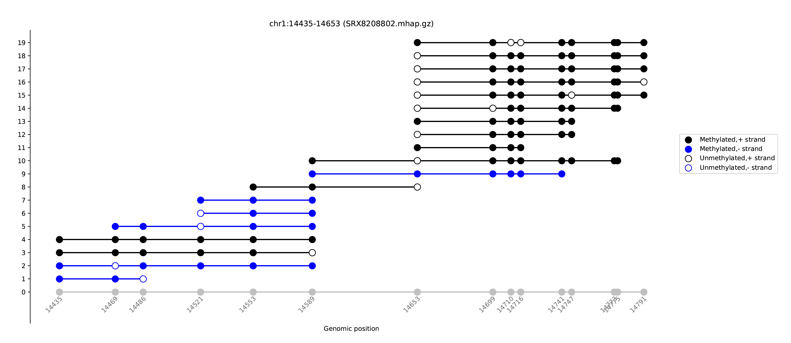
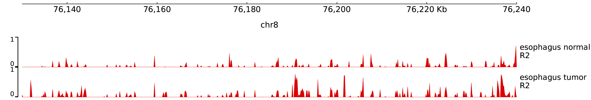

***

mHapTk is a tool kit for analysis of DNA methylation haplotypes. It has 5 sub-commands: tanghulu, stat, genomeWide, R2 and MHBDiscovery. 

```
mHapTk (A tool kit for analysis of DNA methylation haplotypes.)
Usage: mhaptk <command> [options]

Commands:
  genomeWide      calculate methylation metrics for mHaps that cover each CpG site across the genome
  stat            calculate methylation metrics for mHaps that cover predefined regions
  tanghulu        plot the DNA methylation status for mHaps in a region
  R2              calculate linkage disequilibrium between CpG sites within predefined regions
  MHBDiscovery    identification of methylation haplotype blocks within a region or genome-wide
```
The source code of mHapTk is hosted in [github](https://github.com/CCCKW/mHapTk). It is written in python, and should run in Windows, Linux and macOS with python3 installed.
## Prerequisites
The mHapTk requires the following dependencies :

* [numpy >= 1.22.4](https://pypi.org/project/numpy/)
* [pandas >= 1.4.2](https://pypi.org/project/pandas/)
* [matplotlib == 3.5.2](https://pypi.org/project/matplotlib/)
* [scipy == 1.8.1](https://pypi.org/project/scipy/)
* [pytabix == 0.1](http://www.htslib.org/doc/tabix.html) 
* [seaborn == 0.11.2](https://pypi.org/project/seaborn/)
* [tqdm == 4.64.0](https://pypi.org/project/tqdm/)

## Installation
You can install this package using PIP.
```shell
pip install mHapTk
```
or build from source:
```shell
git clone https://github.com/CCCKW/mHapTk
cd mHapTk
python setup.py install 
```

# input
Previously, we have developped a general format for DNA methylation haplotypes (mHaps). The mHap file can be obtained by converting the bam file with [mhapTools](https://jiantaoshi.github.io/mHap/index.html). Besides, it also requires [CpG annotation files](https://jiantaoshi.github.io/mHap/AnnotationFiles.html). 

## mHap files
A typical command below will generate a sorted mhap file, which needs to be indexed.

```
mhaptools convert -i in.bam -c CpG.gz -o out.mhap.gz
tabix -b 2 -e 3 out.mhap.gz
```

## test datasets
To demenstrate the usage of mHapTK, we have provided three datasets, which can be downloaded from [Test DataSets page](https://jiantaoshi.github.io/mhaptk/TestDataSets.html).

 >| Sample ID | Description | Accession Number |
 >| -----: | :----------------------------------------------------------: | :---- |
 >| esophagus_T.mhap.gz  | esophageal squamous cell carcinoma (Pool of 10 samples) | GSE149608 |
 >|  esophagus_N.mhap.gz | adjacent normal esophageal tissue (Pool of 10 samples)  | GSE149608 |
 >|  SRX8208802.mhap.gz  | adjacent normal esophageal tissue | GSM4505856 |

# tanghulu

This function is to visualize the methylation status of the reads that cover a given region. Tanghulu plot was originally introduced in [CGmapTools](https://cgmaptools.github.io/).

```
Usage: mhaptk tanghulu --mhapPath <in.mhap.gz> --cpgPath <CpG.gz> --outputFile <out> --region chr:start-end [--merge] [--simulation] [--outcut outcut]
Options:
  --mhapPath    str   input file, mhap.gz format, generated by mHapTools and indexed
  --cpgPath     str   genomic CpG file, gz format and indexed
  --region      str   one region, in the format of chr:start-end
  --outputFile   str   output file
  --merge       indicates whether identical mHaps should be merged
  --simulation  indicates whether mHaps should be simulated
  --outcut      int   the max length of region to plot [2000]
```

Example of usage:

```
mhaptk tanghulu --mhapPath SRX8208802.mhap.gz --cpgPath hg19_CpG.gz --region chr1:14435-14653 --outputFile SRX8208802.tanghulu.pdf
```
This command will output a PDF file `SRX8208802.tanghulu.pdf` .



When setting the `--merge` option, identical mHaps will be merged. This can be helpful when there are too many reads in a region.

```
mhaptk tanghulu --mhapPath SRX8208802.mhap.gz --cpgPath hg19_CpG.gz --region chr1:14435-14653 --outputFile SRX8208802.tanghulu_merge.pdf --merge
```


Sometimes, we may want to visualize the mHap patterns of different samples that were sequenced with different depth. With the `--simulation` option, a given number (20 by default) of mHaps were simulated to maximize the likelihood given the mHaps observed in each sample.

```
mhaptk tanghulu --mhapPath SRX8208802.mhap.gz --cpgPath hg19_CpG.gz --region chr1:14435-14653 --outputFile SRX8208802.simulation.pdf --simulation
```


# R2

The co-methylation level of pairwise CpGs are measure by linkage disequilibrium r-squared, caculated from individual reads rather than mean methylation. This tool calculates the R2 scores between pairs of CpG sites in a given region. Negative values indicate negative correlation. It can also plot the CpG linkage, which is similar to the [Haploview plot](https://www.broadinstitute.org/screenshots).

```
Usage: mhaptk R2 --tag <tag> --mhapPath <in.mhap.gz> --cpgPath <CpG.gz> --region chr:start-end --outputDir <out> [--mhapView] [--strand strand]
Options:
  --tag         str   prefix of the output files
  --mhapPath    str   input file, mhap.gz format, generated by mHapTools and indexed
  --cpgPath     str   genomic CpG file, gz format and Indexed
  --region      str   one region, in the format of chr:start-end
  --outputDir   str   output directory, created in advance
  --mhapView       plot linkage disequilibrium patterns of pair-wise CpGs
  --strand      str   strand information, one of plus, minus and both [both]
  --longrange indicates whether generate a file in longrange format
```

## txt ouput

The command bellow calculates signed r-squared values and p-values in a pre-defined region. 

```
mhaptk R2 --tag esophagus_T --mhapPath esophagus_T.mhap.gz --cpgPath hg19_CpG.gz --region chr1:2121159-2121449 --outputDir outR2
```
The output file is tsv file with 9 columns, including `Chr`, `posi`, `posj `, `N00`,  `N01`, `N10`, `N11`, `r2` and `pvalue`. 

 >| column |                        Description                         |
 >| :----: | :--------------------------------------------------------: |
 >|  Chr   |     the chromosomes where the two CpG sites locate    |
 >|  posi  |      the location of the first CpG site on the genome |
 >|  posj  |     the location of the second CpG site on the genome |
 >|  N00   |  the number of reads that are unmethylated at both CpG sites  |
 >|  N01   | the number of reads methylated at the second CpG site only |
 >|  N10   | the number of reads methylated at the first CpG site only  |
 >|  N11   | the number of reads that are methylated at both CpG sites  |
 >|   r2   |              r-square               |
 >| pvalue |                p-value              |

```r
chr posi  posj  N00 N01 N10 N11 Chr r2  pvalue
chr1  2121159 2121174 105 0 0 11  1.0 1.027465812430961e-08
chr1  2121159 2121246 53  0 0 6 1.0 3.4469538746084716e-05
chr1  2121159 2121256 45  1 0 4 0.7826087 0.0007033630650303824
chr1  2121159 2121258 43  0 0 4 1.0 0.00038286585959135255
chr1  2121159 2121270 35  1 0 4 0.77777778  0.0015581080330594466
chr1  2121159 2121282 23  0 0 4 1.0 0.0027189711943453876
chr1  2121159 2121294 15  0 0 2 1.0 0.02269720984585155
```

## longrange plot

When setting the `--longrange` option, this tool generates a file in [longrange format](http://wiki.wubrowse.org/Long-range), which can be directly loaded to [WashU Epigenome Browser](https://epigenomegateway.wustl.edu) for visualization.

```
mhaptk R2 --longrange --tag esophagus_T --mhapPath esophagus_T.mhap.gz --cpgPath hg19_CpG.gz --region chr1:2121159-2121449 --outputDir outR2
bgzip esophagus_T_chr1_2121158_2121449_longrange
tabix -b 2 -e 3 esophagus_T_chr1_2121158_2121449_longrange.gz
```

A few lines of the output file are shown below.

```r
chr1  2121159 2121160 chr1:2121174-2121175,1.0
chr1  2121159 2121160 chr1:2121246-2121247,1.0
chr1  2121159 2121160 chr1:2121256-2121257,0.7826087
chr1  2121159 2121160 chr1:2121258-2121259,1.0
chr1  2121159 2121160 chr1:2121270-2121271,0.77777778
chr1  2121159 2121160 chr1:2121282-2121283,1.0
chr1  2121159 2121160 chr1:2121294-2121295,1.0
```

This is a file format that is supprted by [WashU Epigenome Browser](https://epigenomegateway.wustl.edu) but not IGV.


## mHapView

When option `--mHapView` is set, this tool will generate an additional figure, which shows read-level methylation as well as scores of linkage disequilibrium between pairs of CpG sites.

```
mhaptk R2 --mHapView --tag esophagus_T --mhapPath esophagus_T.mhap.gz --cpgPath hg19_CpG.gz --region chr1:2121159-2121449 --outputDir outR2
```


The upper part of the figure shows the DNA methylation status of individual read. Black and white represent methylated and un-methylated CpG sites, respectively. And uncovered sites were plotted in grey. The lower part shows signed linkage disequilibrium scores between pairs of CpG sites.

# MHBDiscovery

DNA methylation of adjacent CpG sites can be co-methylated and forms methylation haplotype blocks (MHBs). It was original introduced in [S. Guo et al., 2017](https://pubmed.ncbi.nlm.nih.gov/28263317/).

```
Usage: mhaptk MHBDiscovery --mhapPath <in.mhap.gz>  --cpgPath <CpG.gz> [--region chr:start-end | -bedPath bed_file.bed ] --outputFile <out>  [--window window] [--r_square r_square] [--p_value p_value]
Options:
  --mhapPath    str     input file, mhap.gz format, generated by mHapTools and indexed
  --cpgPath     str     genomic CpG file, gz format and Indexed
  --region      str     one region, in the format of chr:start-end
  --bedPath     str     input BED file
  --outputFile  str     output file
  --window      integer size of core window [5]
  --r_square    float   R-square cutoff [0.5]
  --p_value     float   P-value cutoff [0.05]
```

A typical command is shown below as an example with the default parameters.
```
mhaptk MHBDiscovery --mhapPath esophagus_T.mhap.gz --cpgPath hg19_CpG.gz --bedPath hg19_1000CpG.bed --window 5 --r_square 0.5 --p_value 0.05 --outputFile out_MHB.bed
```

Alternatively, a single region can be checked to identify MHBs.
```
mhaptk MHBDiscovery --mhapPath esophagus_T.mhap.gz --cpgPath hg19_CpG.gz --region chr1:560000-570000 --window 5 --r_square 0.5 --p_value 0.05 --outputFile out_MHB.bed
```

# stat

This function is to calculate the methylation statistics in a single region or multiple regions. When calculating a single interval, the `--region` parameter should be defined. If there are multiple intervals, a BED file needs to be specified.

```
Usage: mhaptk stat --mhapPath <in.mhap.gz> --cpgPath <CpG.gz> --outputFile <out> [--metrics MM PDR CHALM MHL MCR MBS Entropy] [--region chr:start-end | --bedPath bed_file.bed ] [--minK minK] [--maxK maxK] [--K K] [--strand --strand]
Options:
  --metrics   str     mHap-level metrics, including MM, PDR, CHALM, MHL, MCR, MBS, and Entropy [None]
  --mhapPath  str     input file, mhap.gz format, generated by mHapTools and indexed
  --cpgPath   str     genomic CpG file, gz format and indexed
  --region    str     one region, in the format of chr:start-end
  --bedPath   str     input BED file
  --outputFile str    output file name
  --minK      integer minimum k-mer length for MHL [1]
  --maxK      integer maximum k-mer length for MHL [10]
  --K         integer k-mer length for entropy, PDR, and CHALM, can be 3, 4, or 5 [4]
  --strand    str     strand information, one of plus, minus and both [both]
```

### default run
The output of default run is a TSV file with 10 or more columns, including `chr`, `start`, `end`,`nReads`, `mBase`,`cBase`, `tBase`, `K4plus`, `nDR` and `nMR`, as described below.

 >| column |                         Description                          |
 >| -----: | :----------------------------------------------------------: |
 >| nReads |                  the number of mapped reads                  |
 >|  mBase |           the methylated CpGs within mapped reads            |
 >|  cBase | the number of unmethylated CpGs in reads with discordant methylation |
 >|  tBase |           total number of CpGs within mapped reads           |
 >| K4plus |       the number of mapped reads with at least 4 CpGs        |
 >|    nDR | the number of reads with discordant methylation status among all reads defined by K4plus |
 >|    nMR |                the number of methylated reads                |

```r
<chr>   <start> <end> <nReads> <mBase> <cBase> <tBase> <K4plus> <nDR>   <nMR>
chr1  566519  566816  5395  3900  940   35410 5204  230   658
chr1  912357  912395  41    105   101   590   41    14    14
chr1  913614  913814  331   1155  418   3182  323   111   159
chr1  915387  915494  370   852   137   2089  350   66    162
chr1  942361  942451  305   1214  306   3115  305   94    146
chr1  942459  942498  240   1008  269   2531  227   80    114
chr1  942658  942734  312   1029  278   2452  290   97    153
chr1  960268  960349  186   450   236   1352  186   56    94
chr1  968439  968491  154   615   543   2734  154   56    65
chr1  968558  968583  141   539   299   2509  141   42    49
```

### mHap-level metrics
Besides mean methylation (MM), mHap-level metrics can be calcuated in each region by specifying the `--metrics` option. Some examples are listed below. 

Get the mean methylation level in a region:

```
mhaptk stat --metrics MM --mhapPath esophagus_T.mhap.gz --cpgPath hg19_CpG.gz --region chr1:566520-566816 --outputFile outStat.tsv
```

```r
chr start end nReads  mBase cBase tBase K4plus  nDR nMR MM
chr1  566519  566816  5395  3900  940 35410 5204  230 658 0.11013838
```

Calculate all metrics in a region:
```
mhaptk stat --metrics MM PDR CHALM MHL MCR MBS Entropy --mhapPath esophagus_T.mhap.gz --cpgPath hg19_CpG.gz --region chr1:566520-566816 --outputFile outStat.tsv
```

```r
chr start end nReads  mBase cBase tBase K4plus  nDR nMR MM  CHALM PDR MHL MBS MCR Entropy
chr1  566519  566816  5395  3900  940 35410 5204  230 658 0.11013838  0.1264412 0.04419677  0.12726 0.09133766  0.02654617  0.18668844
```

Calcuate all metrics in a set of regions defined by a BED file:

```
mhaptk stat --metrics MM PDR CHALM MHL MCR MBS Entropy --mhapPath esophagus_T.mhap.gz --cpgPath hg19_CpG.gz  --bedPath esophagus_T_MHB.bed --outputFile outStat.tsv
```

# genomeWide

The mHapTK can also calcuate mHap-level metrics for all reads that cover each individual CpG sites in a genome-wide manner and save the results as [bedGraph](https://genome.ucsc.edu/goldenpath/help/bedgraph.html) files.

```
Usage: mhaptk genomeWide --tag <tag> --mhapPath <in.mhap.gz> --cpgPath <CpG.gz> --metrics <MM PDR CHALM MHL MCR MBS Entropy R2> --outputDir <out> [--minK minK] [--maxK maxK] [--K K] [--strand strand]
Options:
  --tag         str   prefix of the output file(s)
  --mhapPath    str     input file, mhap.gz format, generated by mHapTools and indexed
  --cpgPath     str     genomic CpG file, gz format and indexed
  --metrics     str     mHap-level metrics, including MM, PDR, CHALM, MHL, MCR, MBS, Entropy, and R2
  --outputDir   str     output directory, created in advance
  --minK        integer minimum k-mer length for MHL [1]
  --maxK        integer maximum k-mer length for MHL [10]
  --K           integer k-mer length for entropy, PDR, and CHALM, can be 3, 4, or 5 [4]
  --strand      str     strand information, one of plus, minus and both [both]
```

### genome-wide tracks
Depending on the mHap-level metrics specified through `--metrics` option, mHapTK outputs one or more bedGraph files, named as `tag_metric.bedGraph`. Some examples are listed below. 

Generate mean methylation tracks:

```
mhaptk genomeWide --tag esophagus_T --metrics MM --mhapPath esophagus_T.mhap.gz --cpgPath hg19_CpG.gz --outputDir outGW
```

Generate genome-wide tracks for all 8 metircs:

```
mhaptk genomeWide --tag esophagus_T --metrics MM PDR CHALM MHL MCR MBS Entropy R2 --mhapPath esophagus_T.mhap.gz --cpgPath hg19_CpG.gz --outputDir outGW
```

Although the default parameters usually work well, they can be set by users. Specificially, `--minK` and `--maxK` specify the minimal and maximal length of k-mer for MHL calculation, respectively. Option `--K` set the k-mer length for PDR, CHALM, and Entropy.

```
mhaptk genomeWide --tag esophagus_T --metrics MHL --minK 1 --maxK 10 --mhapPath esophagus_T.mhap.gz --cpgPath hg19_CpG.gz --outputDir outGW
mhaptk genomeWide --tag esophagus_T --metrics PDR CHALM and Entropy --K 4 --mhapPath esophagus_T.mhap.gz --cpgPath hg19_CpG.gz --outputDir outGW
```

### pyGenomeTrack

The resulting bedGraph files can be converted into bigwig files and used by IGV , pyGenomeTrack or washU browser for visualization.

```
# Convert bedGraph file to bigwig
bedGraphToBigWig esophagus_T_R2.bedGraph chrom_sizes esophagus_T_R2.bw

# Visualize with pyGenomeTrack
make_tracks_file --trackFiles esophagus_T_R2.bw -o tracks.ini
pyGenomeTracks --tracks tracks.ini --region chr8:76130000-76240000 -o track.pdf
```



### deepTools
In addition, it can also be combined with [deepTools](https://deeptools.readthedocs.io) for generation of highly customizable images.

```
# Prepares an intermediate matrix that can be used with plotHeatmap
computeMatrix reference-point -S esophagus_N_R2.bw esophagus_T_R2.bw -R esophagus_T_MHB.bed -a 1000 -b 1000 -out matrix.tab.gz

# Creates a heatmap for scores
plotHeatmap --plotFileFormat pdf -m matrix.tab.gz -out heatmap.pdf 
```


